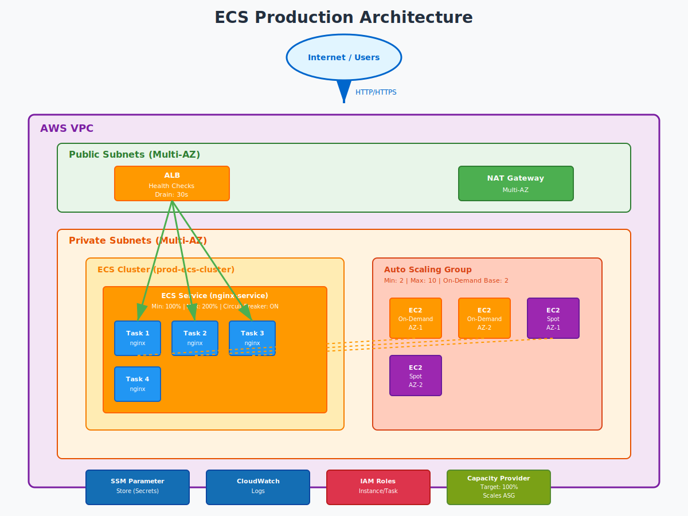

# Production-Grade ECS on EC2 with Terraform

Production-ready AWS ECS (EC2 launch type) infrastructure with zero-downtime deployments, secure secrets management, and cost-optimized capacity.

## Architecture Overview



- **ECS Cluster**: EC2 launch type with Container Insights
- **Compute**: Auto Scaling Group with On-Demand baseline + Spot overflow
- **Load Balancing**: Application Load Balancer with health checks
- **Secrets**: AWS Systems Manager Parameter Store (no secrets in code/state)
- **Scaling**: Service auto-scaling (CPU) + Capacity provider (cluster)
- **Deployment**: Rolling updates with circuit breaker and automatic rollback

## Prerequisites

- AWS Account with appropriate permissions
- Terraform >= 1.5.0
- GitHub repository (for CI/CD)
- AWS OIDC provider configured for GitHub Actions
- SSM Parameter Store secrets (pre-created)

## Quick Start

### 1. Clone Repository

```bash
git clone <repository-url>
cd ecs-prod-container-terraform
```

### 2. Configure Variables

Edit `terraform.tfvars` and update with your actual values. The module will create a new VPC in **us-east-1** using the `terraform-aws-modules/vpc/aws` module.

Example configuration:

```hcl
vpc_name           = "prod-ecs-vpc"
vpc_cidr           = "10.0.0.0/16"
azs                = ["us-east-1a", "us-east-1b"]
private_subnets    = ["10.0.1.0/24", "10.0.2.0/24"]
public_subnets     = ["10.0.101.0/24", "10.0.102.0/24"]
enable_nat_gateway = true
```

### 3. Create SSM Parameters (if not exists)

```bash
aws ssm put-parameter \
  --name "/prod/app/db_password" \
  --value "your-secret-value" \
  --type "SecureString" \
  --region us-east-1

aws ssm put-parameter \
  --name "/prod/app/api_key" \
  --value "your-api-key" \
  --type "SecureString" \
  --region us-east-1
```

### 3.5. Optional Bastion & Secrets

If you need a jump host for maintenance you can enable the built‑in bastion
instance. Populate the following variables in `terraform.tfvars`:

```hcl
bastion_ami      = "ami-0abcdef1234567890"  # current Linux AMI
bastion_key_name = "my-bastion-key"         # or leave blank if using SSM
my_ip_cidr       = "203.0.113.0/32"        # restrict SSH
```

Secrets may also be provisioned directly from Terraform via the
`ssm_parameters` map:

```hcl
ssm_parameters = {
  "/prod/app/db_password" = "super-secret-value"
  "/prod/app/api_key"     = "another-secret"
}
```

### 4. Deploy Infrastructure

**Local deployment:**
```bash
terraform init
terraform plan
terraform apply
```

**CI/CD deployment:**
1. Configure AWS OIDC provider for GitHub Actions
2. Add `AWS_ROLE_ARN` secret to GitHub repository
3. Push to main branch - GitHub Actions will automatically deploy

### 5. Verify Deployment

```bash
# Get ALB DNS name
terraform output alb_dns_name

# Test endpoint
curl http://<alb-dns-name>
```

### 6. Cleanup (Alternative to Terraform Destroy)

If Terraform destroy is taking too long, you can manually clean up resources using AWS CLI:

```bash
# Scale down ECS service
aws ecs update-service --cluster prod-ecs-cluster --service nginx-service --desired-count 0 --region ap-south-1

# Delete ECS service
aws ecs delete-service --cluster prod-ecs-cluster --service nginx-service --region ap-south-1

# Delete ECS cluster (removes capacity provider and ASG)
aws ecs delete-cluster --cluster prod-ecs-cluster --region ap-south-1

# Delete ALB
ALB_ARN=$(aws elbv2 describe-load-balancers --names nginx-service-alb --region ap-south-1 --query 'LoadBalancers[0].LoadBalancerArn' --output text)
aws elbv2 delete-load-balancer --load-balancer-arn $ALB_ARN --region ap-south-1

# Delete target group
TG_ARN=$(aws elbv2 describe-target-groups --names nginx-service-tg-ip --region ap-south-1 --query 'TargetGroups[0].TargetGroupArn' --output text)
aws elbv2 delete-target-group --target-group-arn $TG_ARN --region ap-south-1

# Delete SSM parameters
aws ssm delete-parameter --name "/prod/app/db_password" --region ap-south-1
aws ssm delete-parameter --name "/prod/app/api_key" --region ap-south-1

# Delete VPC and subnets (if created by Terraform)
VPC_ID=$(aws ec2 describe-vpcs --filters "Name=tag:Name,Values=prod-ecs-vpc" --region ap-south-1 --query 'Vpcs[0].VpcId' --output text)
aws ec2 delete-vpc --vpc-id $VPC_ID --region ap-south-1
```

## Architecture Decisions

### Zero-Downtime Deployments

- **Min Healthy**: 100% (old tasks stay running)
- **Max Percent**: 200% (new tasks start before old stop)
- **Deregistration Delay**: 30s (drain in-flight requests)
- **Circuit Breaker**: Enabled (auto-rollback on failure)

### CI/CD Integration

GitHub Actions workflow is configured at `.github/workflows/terraform.yml`:

- **Pull Requests**: Runs `terraform plan` for review
- **Push to main**: Runs `terraform plan` + `terraform apply`
- **Authentication**: Uses AWS OIDC (no long-lived credentials)

**Setup:**
1. Create OIDC provider in AWS IAM
2. Create IAM role with trust policy for GitHub
3. Add `AWS_ROLE_ARN` to GitHub Secrets

## Network Mode

- **bridge**: Uses Docker bridge networking with dynamic port mapping
- **Target Group Type**: instance (ALB routes to EC2 instances)
- **Security Groups**: Instance-level security
- **Load Balancer Integration**: Dynamic port mapping via ECS agent

### Secrets Management

- Secrets stored in SSM Parameter Store (SecureString)
- Task execution role reads secrets at startup
- Secrets injected as environment variables (not in Terraform state)
- Least privilege IAM (only specific parameters accessible)

### Cost-Optimized Capacity

- **On-Demand Base**: 2 instances (guaranteed capacity)
- **Spot Overflow**: All instances above base (cost savings)
- **Spot Strategy**: capacity-optimized (minimize interruptions)
- **Capacity Provider**: Auto-scales cluster based on task demand

### Scaling Strategy

- **Service Scaling**: CPU-based (target 70%)
- **Cluster Scaling**: Capacity provider (target 100% utilization)
- **Multi-AZ**: Tasks spread across availability zones
- **Placement**: Spread by AZ, binpack by memory

## Assumptions

### Infrastructure

- **VPC**: New VPC created by Terraform with CIDR 10.0.0.0/16
- **Subnets**: 
  - Private subnets (2 AZs) for ECS instances
  - Public subnets (2 AZs) for ALB
- **NAT Gateway**: Created by VPC module for private subnet egress
- **Internet Gateway**: Created by VPC module for ALB ingress

### Networking

- Private subnets have route to NAT Gateway (0.0.0.0/0 → nat-xxx)
- Public subnets have route to Internet Gateway (0.0.0.0/0 → igw-xxx)
- Security groups allow:
  - ALB: Inbound 80/443 from internet
  - ECS: Inbound from ALB only
  - ECS: Outbound to internet (for image pulls, SSM, CloudWatch)

### Secrets

- SSM parameters pre-created in Parameter Store
- Parameters use SecureString type (KMS encrypted)
- Parameter names: `/prod/app/db_password`, `/prod/app/api_key`

### Permissions

- AWS credentials configured (AWS CLI, environment variables, or IAM role)
- Permissions to create: IAM roles, EC2 instances, ECS resources, ALB, ASG, CloudWatch

### Configuration

- All infrastructure values defined in `terraform.tfvars`
- VPC and networking created automatically
- Region: us-east-1 (configurable)

## Project Structure

```
.
├── .github/
│   └── workflows/
│       └── terraform.yml       # GitHub Actions CI/CD
├── modules/
│   ├── iam/                    # IAM roles and policies
│   ├── security-groups/        # Security groups
│   ├── alb/                    # Application Load Balancer
│   ├── asg/                    # Auto Scaling Group
│   ├── ecs-cluster/            # ECS Cluster and Capacity Provider
│   └── ecs-service/            # ECS Service and Task Definition
├── main.tf                     # Root module with VPC integration
├── bastion.tf                  # Optional bastion host
├── variables.tf                # Input variable declarations
├── terraform.tfvars            # Variable values (edit this)
├── outputs.tf                  # Output values
├── versions.tf                 # Terraform and provider versions
└── README.md                   # This file
```

## Key Resources Created

- **VPC**: `prod-ecs-vpc` with NAT Gateway and Internet Gateway
- **ECS Cluster**: `prod-ecs-cluster`
- **ECS Service**: `nginx-service`
- **ALB**: `nginx-service-alb`
- **ASG**: `prod-ecs-cluster-asg`
- **Capacity Provider**: `prod-ecs-cluster-capacity-provider`
- **IAM Roles**: Instance, task execution, task roles
- **Security Groups**: ALB, ECS tasks
- **CloudWatch Log Group**: `/ecs/nginx-service`

## Monitoring & Operations

### Key Metrics

- `ECSServiceAverageCPUUtilization`: Service CPU usage
- `RunningTaskCount`: Number of running tasks
- `UnHealthyHostCount`: Unhealthy ALB targets
- `HTTPCode_Target_5XX_Count`: Application errors
- `TargetResponseTime`: Request latency

### Recommended Alarms

1. Service CPU > 85% for 5 minutes
2. Unhealthy targets > 0 for 2 minutes
3. 5xx errors > 10 in 5 minutes
4. Running tasks < desired for 5 minutes
5. ASG at max capacity for 10 minutes

### Operational Tasks

**Deploy New Version**:
```bash
# Update task definition (new image tag)
# Apply Terraform changes
terraform apply

# Monitor deployment
aws ecs describe-services \
  --cluster prod-ecs-cluster \
  --services nginx-service
```

**Scale Service**:
```bash
# Update desired_count in terraform.tfvars
desired_count = 8

# Apply changes
terraform apply
```

**Rotate Secrets**:
```bash
# Update SSM parameter
aws ssm put-parameter \
  --name "/prod/app/db_password" \
  --value "new-secret-value" \
  --type "SecureString" \
  --overwrite

# Force new deployment (picks up new secret)
aws ecs update-service \
  --cluster prod-ecs-cluster \
  --service nginx-service \
  --force-new-deployment
```

## Time Spent

**Total**: ~3 hours

- Infrastructure code: 90 minutes
- Documentation (DESIGN.md): 45 minutes
- Stress test scenarios (ADDENDUM.md): 45 minutes

## Shortcuts Taken

1. **TLS**: ALB listener uses HTTP (would use HTTPS with ACM certificate)
2. **Monitoring**: Basic CloudWatch (would add custom dashboards, SNS alerts)
3. **Container**: Used nginx:latest (would use specific version tag)
4. **IAM**: Simplified policies (would add more granular resource restrictions)
5. **Backup**: No automated backups (would add EBS snapshots, config backups)

## What I Would Do Next (With More Time)

### Security Enhancements

- [ ] Enable HTTPS on ALB with ACM certificate
- [ ] Add WAF rules (rate limiting, SQL injection protection)
- [ ] Implement VPC Flow Logs for network monitoring
- [ ] Add AWS Config rules for compliance checking
- [ ] Enable GuardDuty for threat detection
- [ ] Implement secrets rotation (Lambda + Secrets Manager)

### Operational Improvements

- [ ] Create CloudWatch dashboards (service health, capacity, costs)
- [ ] Set up SNS topics and email/Slack alerts
- [ ] Implement automated runbooks (Systems Manager Automation)
- [ ] Add X-Ray tracing for distributed tracing
- [ ] Create Terraform modules for reusability
- [ ] Add remote state backend (S3 + DynamoDB)

### Cost Optimization

- [ ] Replace NAT Gateway with VPC endpoints (ECR, S3, CloudWatch)
- [ ] Implement Reserved Instances for On-Demand baseline
- [ ] Add cost allocation tags for chargeback
- [ ] Set up AWS Cost Anomaly Detection
- [ ] Implement auto-scaling schedule (scale down off-hours)

### Resilience & DR

- [ ] Multi-region deployment with Route 53 failover
- [ ] Automated backup and restore procedures
- [ ] Chaos engineering tests (Spot interruptions, AZ failures)
- [ ] Implement blue/green deployment strategy
- [ ] Add canary deployments (gradual rollout)

### Testing

- [ ] Integration tests (Terratest)
- [ ] Load testing (Locust, k6)
- [ ] Security scanning (Checkov, tfsec)
- [ ] Compliance validation (AWS Config, Prowler)

## AI/Tools Used

- **GitHub Copilot**: Terraform syntax, IAM policy structure
- **AWS Documentation**: ECS capacity provider configuration, ALB health checks
- **Terraform Registry**: Module examples, best practices

## Cleanup

**Terraform destroy:**
```bash
terraform destroy
```

**Note**: Destroy takes ~3-4 minutes due to:
- ALB connection draining (30s)
- ASG instance termination (60-90s)
- ECS service cleanup

If ECS service gets stuck in DRAINING state:
```bash
aws ecs delete-service --cluster prod-ecs-cluster --service nginx-service --force
terraform destroy
```

## Support

For questions or issues:
1. Check GitHub Actions logs for deployment errors
2. Check AWS CloudWatch Logs for task/service errors
3. Verify IAM permissions and security group rules
4. Review Terraform state for resource dependencies

## License

MIT License - Free to use and modify.
